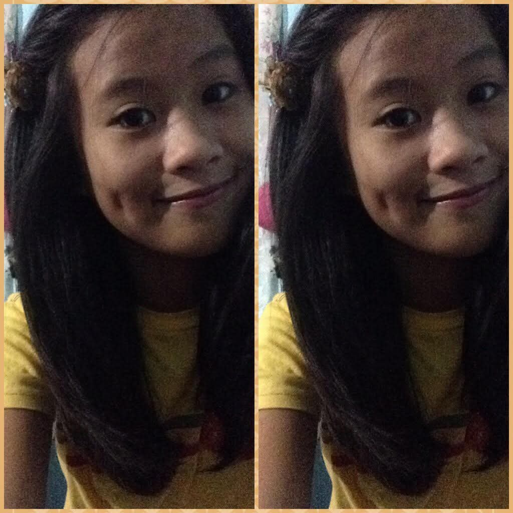
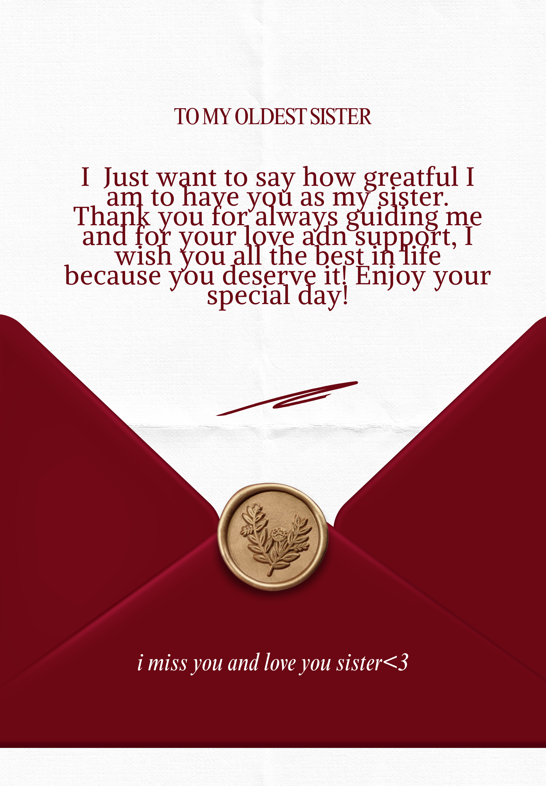

<!DOCTYPE html>
<html lang="en">
<head>
  <meta charset="UTF-8" />
  <meta name="viewport" content="width=device-width, initial-scale=1.0"/>
  <title>Happy Birthday Matrix</title>
  
</head>
<body>

  

    <h2>I HOPE YOU LIKE MY SIMPLE GIFT🦋</h2>
    
Turn on audio for music

  

  <audio id="bg-music" loop>
    <source src="daylight.mp3" type="audio/mpeg">
  </audio>

  <button class="audio-btn" id="audio-toggle" onclick="toggleAudio()">⏸</button>

  <canvas id="bg-canvas"></canvas>

  

    

      
AUGUST 12 2000

      
    

    

      
26 YEARS OLD

      
    

    

    

      

        

          
        

        

          
        

      

    

  

  
</body>
</html>
